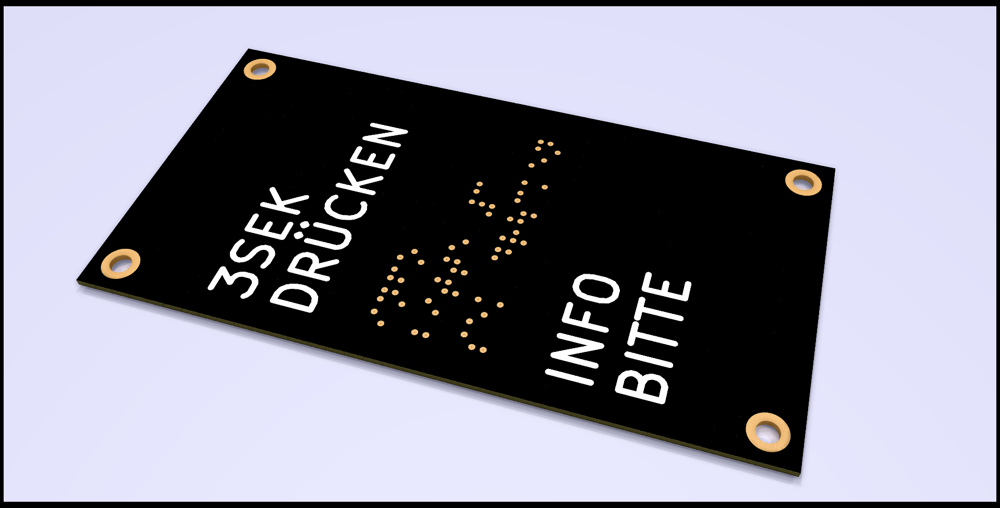
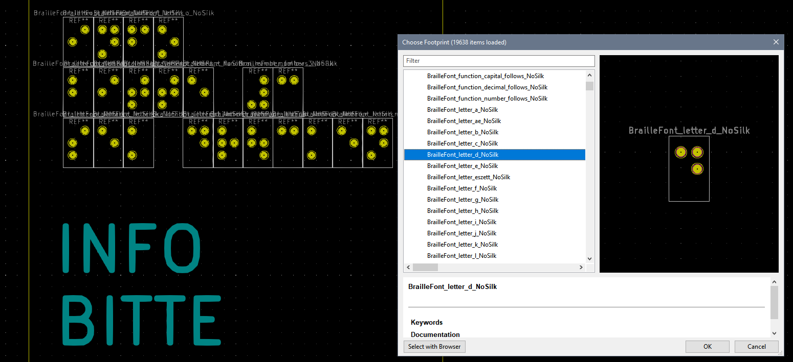

# Braille_kicad
Configurable Braille font footprints for KiCad

---

### Braille Font on Frontpanels

### Idea

The idea behind this KiCad library stems from misapropriating PCB boards as front panels for cases.
PCB manufacturing is a very affordable way to create mechanical components like that. The recent introduction of low cost aluminium-core PCBs further underlines this practice.

When designing a product from the outside, it is a good thing to remove barriers for disabled people in general. One way to do it for blindnes is to use the tactile braille font to name things.

This library can be used to assemble words from individual characters.
Please refer to other sources of how to use the Braille font (e.g. using special delimiters or language specific changes) and keep the dimensions to something that is standardized like the E-DIN 32976 norm.

### Specification & Script Usage

The `/script` directory contains a python script that generates all the footprint files. You can define new Braille symbols in the `braille_characters.csv` file by refering to the following layout for the dot arrangement:

| 1 | 2 |
|---|---|
| 3 | 4 |
| 5 | 6 |

The current set of symbols is designed for the German language, which contains the special characters "ä", "ö", "ü" and "ß".

**Todo**: the current python script is not yet configurable (size options and Silk on/off)

### Further Resources

- What is Braille? [lvib.org](https://www.lvib.org/what-is-braille/)
- E-DIN 32976 measurements [taktile-leitsysteme.de](https://shop.taktile-leitsysteme.de/Definitionen-Allgemeines:_:18.html)
- [Tact-Tiles](https://github.com/Tact-Tiles)

---

### License

This library is licensed under MIT and CC-BY. You can use it for any project (including commercial work) as long as attribution is given. 
